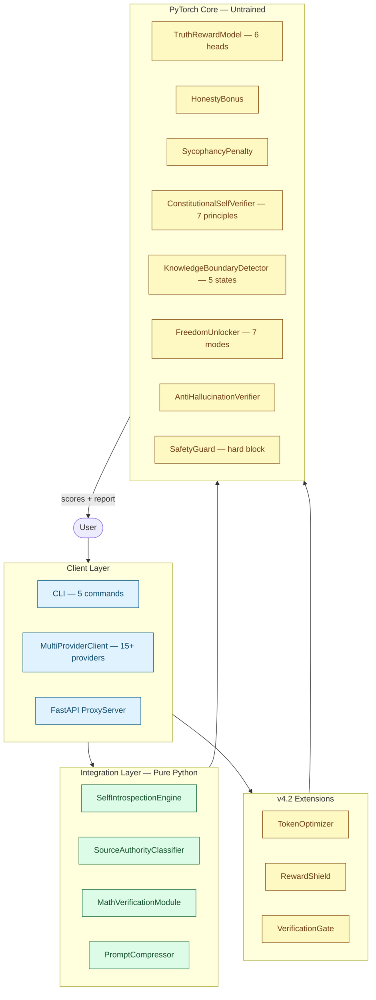

# LibertyMind

[](https://www.python.org/)
[](https://pytorch.org/)
[](tests/)
[](LICENSE)
[](https://github.com/ntd25022006q/LibertyMind/actions)

Python/PyTorch framework for honesty-first AI output verification. Rule-based tools work today; neural modules are architectural scaffolding awaiting training data.

---

## The Core Distinction

| | Status | What it means |
|---|---|---|
| **Rule-based tools** | Work now | Pure Python, no GPU. Introspect LLMs, compress prompts, verify math, classify sources, proxy requests. |
| **Neural modules** | Untrained | Real PyTorch `nn.Module` architectures with correct I/O contracts. Outputs are random until trained on labeled data. |

> **This is not a ready-to-deploy RLHF replacement.** It is a structured verification architecture to train and iterate on, plus practical tools you can use today.

---

## Architecture



---

## Working Tools

### PromptCompressor

Rule-based text compression. Removes filler phrases, replaces verbose patterns, collapses whitespace. Five levels: `NONE`, `LIGHT`, `MODERATE`, `AGGRESSIVE`, `EXTREME`.

```python
from src.core.token_optimizer import PromptCompressor, CompressionLevel

result = PromptCompressor.compress_text(
    "In order to achieve the goal, due to the fact that it is important, "
    "I think that we should proceed with the plan.",
    CompressionLevel.MODERATE,
)
print(result["compressed"])
# → "to achieve the goal, because it is important, we should proceed with the plan."
```

### MathVerificationModule

Safe AST-based evaluator. Verifies LLM math claims without calling `eval()`. Whitelisted operators and functions only.

```python
from src.core.limitation_fixers import MathVerificationModule

mvm = MathVerificationModule()
result = mvm.verify_calculation("2 + 3 * 4", "14")
assert result["is_correct"] is True
```

### SourceAuthorityClassifier

Classifies URLs into a 5-tier system by domain authority. No GPU required.

```python
from src.integration.deep_search import SourceAuthorityClassifier, SourceTier

info = SourceAuthorityClassifier.classify_url("https://arxiv.org/paper/1234")
assert info.tier == SourceTier.TIER1_ACADEMIC

ranked = SourceAuthorityClassifier.rank_sources(sources)
reliable = SourceAuthorityClassifier.filter_reliable(sources, min_tier=SourceTier.TIER3_RELIABLE)
```

### SelfIntrospectionEngine

Probes an LLM across 10 categories, analyzes responses for RLHF controls, censorship, and sycophancy using regex-based pattern detection.

```python
from src.integration.self_introspection import SelfIntrospectionEngine

engine = SelfIntrospectionEngine()
report = engine.introspect(my_llm_call_fn)
print(report.summary())
```

### MultiProviderClient

Unified interface for 15+ LLM providers. Auto-detects local providers. Injects LibertyMind honesty directives automatically.

```python
from src.clients.multi_provider import MultiProviderClient

client = MultiProviderClient(provider="openai", model="gpt-4")
response = client.liberty_chat("Does gravity slow down time?")
```

---

## Neural Modules (Untrained)

These modules define the computation graph and I/O contracts for a truth-based reward system. They accept correct tensor shapes and return correct data types, but their weights are randomly initialized.

| Module | Architecture | Purpose (after training) |
|--------|-------------|--------------------------|
| `TruthRewardModel` | 6 verification heads + meta-combiner + uncertainty estimator | Score prompt/response pairs across 6 dimensions |
| `HonestyBonus` | 3-class detector (confident / uncertain / admit_unknown) | Reward admitting uncertainty on hard questions |
| `SycophancyPenalty` | Agreement detector (2-input MLP) + claim verifier (Tanh) | Penalize sycophantic agreement with incorrect claims |
| `ConstitutionalSelfVerifier` | 7 principle-specific detectors | Self-check output against 7 verifiable principles |
| `KnowledgeBoundaryDetector` | 32-domain classifier + expertise/freshness/conflict/coverage/avoidance estimators | Classify into 5 knowledge states |
| `FreedomUnlocker` | Mode selector + evidence/confidence/creative/debate estimators | Unlock 7 freedom modes with responsibility |
| `AntiHallucinationVerifier` | Claim detector + 6-type classifier + consistency + plausibility + pre-gen predictor | Flag 6 hallucination types; predict risk before generation |
| `SafetyGuard` | Per-category Sigmoid detectors | Hard block (reward = -10) for safety violations |
| `RewardShield` | PenaltyDetector (7 types) + SlowThinkBonus + AccuracyGate (4 checks) | Detect and correct unfair RLHF penalties |
| `TokenOptimizer` | Multi-head attention importance scorer + semantic compressor + adaptive budget | Neural token budget allocation |
| `VerificationGate` | Thinking depth estimator + claim verifier + cross-reference validator | Gate output into 5 verification states |

### What Training Would Require

1. **Labeled data** — truthful vs. sycophantic vs. hallucinated responses with ground-truth labels
2. **Training loops** — supervised fine-tuning (`CrossEntropyLoss` / `MSELoss`), preference optimization (DPO / PPO)
3. **Real embeddings** — from your LLM backbone's last hidden state (currently using `torch.randn()` placeholders)

---

## CLI

```bash
libertymind providers                              # List 15+ providers & status
libertymind chat --provider openai --model gpt-4 "msg"  # Chat via any provider
libertymind chat --liberty "msg"                   # Chat with honesty system prompt
libertymind introspect --provider openai -o out.json   # Introspect an LLM
libertymind reward --prompt "q" --response "a"     # Compute reward (untrained)
libertymind serve --port 8080 --upstream <url>     # Run proxy server
```

---

## Setup

```bash
git clone https://github.com/ntd25022006q/LibertyMind.git
cd LibertyMind

# Core only (no PyTorch, no provider SDKs)
pip install -e .

# With PyTorch neural modules
pip install -e ".[torch]"

# With specific providers
pip install -e ".[openai,anthropic,torch]"

# Everything
pip install -e ".[all]"
```

**Prerequisites:** Python >= 3.9, PyTorch >= 2.0 (neural modules only), NumPy >= 1.24, PyYAML >= 6.0

---

## Module Reference

```
src/
├── core/                          # PyTorch neural modules (untrained)
│   ├── liberty_mind.py            # LibertyMind, LibertyMindConfig, SafetyGuard
│   ├── truth_reward.py            # TruthRewardModel, HonestyBonus, SycophancyPenalty
│   ├── constitutional_self_verify.py  # ConstitutionalSelfVerifier — 7 principles
│   ├── knowledge_boundary.py      # KnowledgeBoundaryDetector, PreciseHonestyReward
│   ├── freedom_unlocker.py        # FreedomUnlocker, OpinionUnlocker, DisagreementUnlocker, SpeculationUnlocker
│   ├── limitation_fixers.py       # AntiHallucinationVerifier, MathVerificationModule, ContextMemoryManager, CulturalAwarenessModule, ConfidenceCalibrator
│   ├── multi_pass_sampler.py      # MultiPassTruthSampler, AdaptiveSampler
│   ├── token_optimizer.py         # TokenOptimizer (neural), PromptCompressor (rule-based)
│   ├── reward_shield.py           # RewardShield, PenaltyDetector, SlowThinkBonus, AccuracyGate
│   └── verification_gate.py       # VerificationGate, ClaimVerifier, CrossReferenceValidator
├── integration/                   # Pure Python engines (work now)
│   ├── self_introspection.py      # SelfIntrospectionEngine — 10 probe categories
│   └── deep_search.py            # SourceAuthorityClassifier — 5-tier, DeepSearchEngine
├── clients/                       # Multi-provider client
│   └── multi_provider.py         # MultiProviderClient — 15+ providers
├── server/                        # Proxy server
│   └── proxy_server.py           # FastAPI proxy
└── cli.py                         # CLI — 5 commands
```

---

## Testing

111 tests across 3 files. Verifies tensor shapes, value ranges, dataclass contracts, enum completeness, adapter initialization, and pipeline integration.

```bash
pytest tests/ -v                  # Full suite
pytest tests/test_liberty_mind.py -v   # Core neural modules
pytest tests/test_v42_modules.py -v    # v4.2 extensions
pytest tests/test_multi_provider.py -v # Multi-provider client
ruff check src/ tests/            # Lint
mypy src/                         # Type check
```

| File | Count | Scope |
|------|-------|-------|
| `test_liberty_mind.py` | 14 | TruthRewardModel, HonestyBonus, SycophancyPenalty, ConstitutionalSelfVerifier, MultiPassTruthSampler, LibertyMind integration |
| `test_v42_modules.py` | 52 | TokenOptimizer, PromptCompressor, RewardShield, VerificationGate, SourceAuthorityClassifier, DeepSearchEngine |
| `test_multi_provider.py` | 50 | Provider registry, adapters, MultiProviderClient, SelfIntrospectionEngine, liberty_chat |

---

## Contributing

See [CONTRIBUTING.md](CONTRIBUTING.md). Key areas:

- **Training data and training loops** — the single most important missing piece
- **New provider adapters** — the adapter architecture makes this straightforward
- **Edge cases** — especially the AST evaluator and regex pattern detectors
- **Benchmarking** — quantitative comparisons of LibertyMind-primed vs. unprimed LLM responses

---

## License

[MIT](LICENSE) — Copyright &copy; 2026 Nguyen Tien Dat. All rights reserved.
