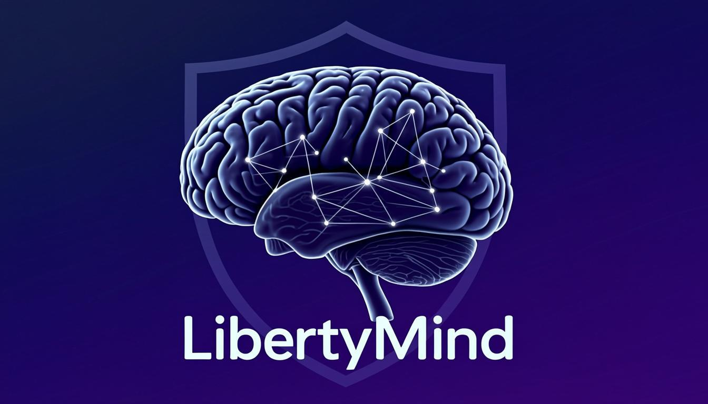
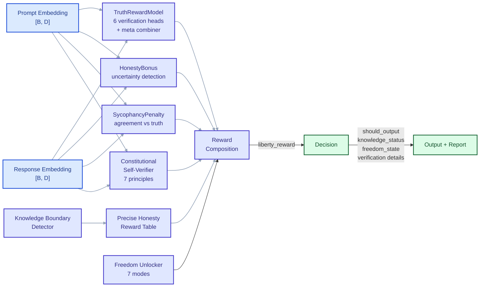
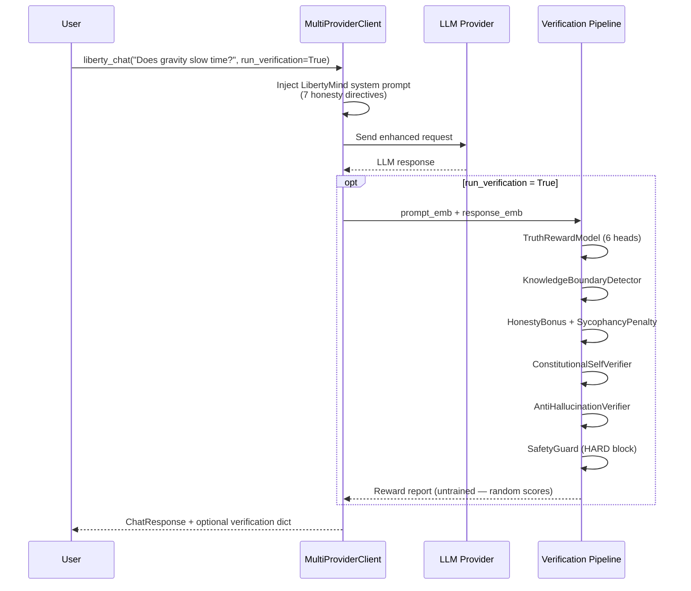

<div align="center">



# LibertyMind

**Python framework for honesty-first AI verification — working rule-based tools today, neural architectures ready for training.**

[](https://www.python.org/)
[](https://pytorch.org/)
[](LICENSE)
[](pyproject.toml)
[](tests/)
[](https://github.com/ntd25022006q/LibertyMind/actions)

[Architecture](#-architecture-overview) · [Working Tools](#-working-tools) · [Neural Modules](#-neural-modules-untrained) · [CLI](#-cli-reference) · [Quick Start](#-quick-start) · [Testing](#-testing) · [Contributing](#-contributing)

</div>

---

## Screenshot / Demo

<p align="center">
  
</p>

<p align="center"><em>All 116 tests passing across the core modules, v4.2 extensions, and multi-provider client suite.</em></p>

---

## What It Does

LibertyMind is a Python framework that proposes an alternative to RLHF (Reinforcement Learning from Human Feedback) for AI alignment. Where RLHF trains models to maximize human approval — which can reward sycophancy, punish honesty, and encourage overconfident but pleasing answers — LibertyMind designs a verification architecture that rewards truthfulness, penalizes sycophancy, and allows AI to express honest uncertainty, respectful disagreement, and evidence-based opinions.

The framework contains **two fundamentally different categories of components**, and being honest about this distinction is central to the project's philosophy:

| | What it is | What it does today |
|---|---|---|
| **Rule-based tools** | Pure Python, no GPU needed | **Work right now** — introspect LLMs for RLHF controls, compress prompts, classify source authority, verify math expressions, proxy API requests with honesty directives |
| **Neural modules** | Real PyTorch architectures — multi-head attention, feed-forward verification networks, classification heads, meta-combiners | **Output random numbers** — they are untrained and need labeled training data plus training loops before they produce meaningful verification scores |

> **If you need a ready-to-deploy "RLHF replacement" — this is not it yet.**
> If you want a well-structured verification architecture to train and iterate on, plus practical honesty-first tools you can use today — read on.

The rule-based tools are immediately useful: the `SelfIntrospectionEngine` can probe any LLM to reveal its RLHF control patterns, censorship maps, and sycophancy tendencies. The `PromptCompressor` reduces token waste by stripping filler phrases and verbose patterns. The `SourceAuthorityClassifier` ranks information sources by domain authority. The `MathVerificationModule` verifies LLM math claims using a safe AST-based evaluator. And the `MultiProviderClient` gives you a unified interface to 15+ LLM providers with LibertyMind honesty directives injected automatically.

The neural modules — `TruthRewardModel`, `SycophancyPenalty`, `KnowledgeBoundaryDetector`, `AntiHallucinationVerifier`, `RewardShield`, `TokenOptimizer`, `VerificationGate`, and others — define the computation graph and I/O contracts for a complete truth-based reward system. They accept the correct tensor shapes and return the correct data types. But without training data and training loops, their outputs are arbitrary. They are architectural scaffolding, not functioning judges.

---

## Architecture Overview

### Three-Layer System

```mermaid
flowchart TD
    classDef working fill:#dcfce7,stroke:#166534,stroke-width:2px,color:#14532d
    classDef untrained fill:#fef9c3,stroke:#854d0e,stroke-width:2px,color:#713f12
    classDef client fill:#e0f2fe,stroke:#075985,stroke-width:2px,color:#0c4a6e

    User([User / Developer]) --> Client

    subgraph Client["Multi-Provider Client Layer"]
        direction LR
        MPC[MultiProviderClient<br/>15+ providers]:::client
        CLI[CLI — 5 commands]:::client
        Proxy[ProxyServer<br/>FastAPI]:::client
    end

    Client -->|request / introspect| L3

    subgraph L3["v4.2 Extensions Layer"]
        direction LR
        PC[PromptCompressor<br/>rule-based — WORKS]:::working
        TO[TokenOptimizer<br/>neural — UNTRAINED]:::untrained
        RS[RewardShield<br/>neural — UNTRAINED]:::untrained
        VG[VerificationGate<br/>neural — UNTRAINED]:::untrained
    end

    Client -->|introspect| L2

    subgraph L2["Integration Layer — Pure Python"]
        direction LR
        SIE[SelfIntrospectionEngine<br/>WORKS]:::working
        SAC[SourceAuthorityClassifier<br/>WORKS]:::working
        MVM[MathVerificationModule<br/>WORKS]:::working
    end

    L2 -->|embeddings| L1
    L3 -->|embeddings| L1

    subgraph L1["PyTorch Core Layer"]
        direction LR
        TRM[TruthRewardModel<br/>6 verification heads<br/>UNTRAINED]:::untrained
        HB[HonestyBonus<br/>UNTRAINED]:::untrained
        SP[SycophancyPenalty<br/>UNTRAINED]:::untrained
        CSV[ConstitutionalSelfVerifier<br/>7 principles<br/>UNTRAINED]:::untrained
        KBD[KnowledgeBoundaryDetector<br/>5 states<br/>UNTRAINED]:::untrained
        FU[FreedomUnlocker<br/>7 modes<br/>UNTRAINED]:::untrained
        AHV[AntiHallucinationVerifier<br/>6 hallucination types<br/>UNTRAINED]:::untrained
        SG[SafetyGuard<br/>HARD block<br/>UNTRAINED]:::untrained
    end

    L1 -->|scores| L3
    L3 -->|response + report| User

    linkStyle 0,1,2,3,4,5,6,7,8,9,10 stroke:#94a3b8,stroke-width:1.5px
```

The architecture is organized into three distinct layers, each with a clear responsibility boundary. The **PyTorch Core Layer** contains the neural module definitions — `TruthRewardModel` with its 6 specialized verification heads, `ConstitutionalSelfVerifier` checking against 7 scientific principles, `KnowledgeBoundaryDetector` classifying knowledge into 5 states (known, partially known, unknown, conflicting, outdated), `FreedomUnlocker` with 7 freedom modes (creative, opinionated, exploratory, debate, teaching, analytical, speculative), `AntiHallucinationVerifier` detecting 6 hallucination types, and `SafetyGuard` enforcing hard safety blocks. All of these are real PyTorch `nn.Module` subclasses with proper forward passes, but their weights are randomly initialized and they require training data to produce meaningful outputs.

The **Integration Layer** contains pure Python engines that work by design — `SelfIntrospectionEngine` probes LLMs across 10 categories using regex-based pattern detection, `SourceAuthorityClassifier` ranks URLs by domain into 5 tiers, and `MathVerificationModule` evaluates expressions via a safe AST walker. No GPU or training is needed for these.

The **v4.2 Extensions Layer** mixes both: `PromptCompressor` is a working rule-based text reducer, while `TokenOptimizer`, `RewardShield`, and `VerificationGate` are neural architectures awaiting training.

### Reward Computation Pipeline



The reward computation pipeline in `LibertyMind.compute_liberty_reward()` takes a prompt embedding and a response embedding, feeds them through all core modules in parallel, and composes the results using configurable weights. The final `liberty_reward` combines truth reward, honesty bonus, sycophancy penalty, consistency score, precise honesty reward, and freedom bonus. Penalties are applied for hallucination detection, overconfidence, and constitutional self-verification failures. Safety violations trigger a hard block (reward set to -10.0). The output includes not just a scalar reward but a full diagnostic report with knowledge status, freedom state, verification details, and confidence calibration.

### `liberty_chat()` Flow



When you call `liberty_chat()` with `run_verification=True`, the client first injects the LibertyMind system prompt (7 honesty directives) into the LLM request, sends it to the configured provider, receives the response, and then runs the full reward pipeline using placeholder embeddings. Because the neural modules are untrained, the verification scores are not meaningful for production decisions — but the pipeline is fully wired so developers can inspect the complete output structure and iterate on training.

---

## Working Tools

These components work right now with no GPU, no training data, and no API key (unless you are calling an LLM provider). They are pure Python implementations that provide immediate practical value.

### PromptCompressor

Rule-based text compression that removes filler phrases, replaces verbose patterns, and collapses whitespace. It operates on a dictionary of known filler phrases (e.g., "I think that", "In my opinion", "It goes without saying") and redundant patterns (e.g., "in order to" → "to", "due to the fact that" → "because"). Five compression levels are available: `NONE` (no change), `LIGHT` (remove filler + collapse whitespace), `MODERATE` (also replace verbose patterns), `AGGRESSIVE` (also remove short low-information sentences), and `EXTREME` (keep only the first sentence of each paragraph). This is useful for reducing token costs when sending prompts to LLM APIs, and for stripping unnecessary hedging from AI-generated responses.

```python
from src.core.token_optimizer import PromptCompressor, CompressionLevel

result = PromptCompressor.compress_text(
    "In order to achieve the goal, due to the fact that it is important, "
    "I think that we should proceed with the plan.",
    CompressionLevel.MODERATE,
)
print(result["compressed"])
# → "to achieve the goal, because it is important, we should proceed with the plan."
print(f"Saved {result['saved']} tokens ({1-result['ratio']:.0%} reduction)")
```

### MathVerificationModule

Safe AST-based math expression evaluator that verifies LLM math claims without calling `eval()`. It parses expressions into a Python AST, walks the tree, and only evaluates nodes that match a strict whitelist: numeric constants, binary operators (`+`, `-`, `*`, `/`, `**`, `%`), unary operators, and a small set of math functions (`sqrt`, `sin`, `cos`, `tan`, `log`, `log10`, `abs`, `round`, `ceil`, `floor`, `factorial`). Any AST node type not on the whitelist raises a `ValueError`, preventing code injection. The module compares the computed result with the LLM's claimed result using floating-point tolerance (1e-6) and returns a structured dictionary with `is_correct`, `correct_result`, `claimed_result`, and an optional `suggestion` when the answer is wrong.

```python
from src.core.limitation_fixers import MathVerificationModule

mvm = MathVerificationModule()
result = mvm.verify_calculation("2 + 3 * 4", "14")
assert result["is_correct"] is True
assert result["correct_result"] == 14.0

result = mvm.verify_calculation("sqrt(144)", "13")
assert result["is_correct"] is False
assert result["suggestion"] == "Correct answer: 12.0"
```

### SourceAuthorityClassifier

Classifies URLs by domain authority into a 5-tier system. **Tier 1 — Academic/Government**: `.edu`, `.gov`, `.ac.uk`, `.ac.jp`, `arxiv.org`, `nature.com`, `science.org`, `pubmed.ncbi.nlm.nih.gov`, `who.int` (authority score 0.95). **Tier 2 — Established**: `wikipedia.org`, `reuters.com`, `apnews.com`, `bbc.com` (authority score 0.80). **Tier 3 — Reliable**: `medium.com`, `stackoverflow.com` (authority score 0.60). **Tier 4 — Community**: `reddit.com`, `twitter.com`, `facebook.com` (authority score 0.35). **Tier 5 — Unverified**: everything else (authority score 0.15). It also provides `rank_sources()` for sorting by authority and `filter_reliable()` for removing sources below a minimum tier.

```python
from src.integration.deep_search import SourceAuthorityClassifier, SourceTier

info = SourceAuthorityClassifier.classify_url("https://arxiv.org/paper/1234")
assert info.is_academic is True
assert info.tier == SourceTier.TIER1_ACADEMIC

info = SourceAuthorityClassifier.classify_url("https://reddit.com/r/test")
assert info.tier == SourceTier.TIER4_COMMUNITY

ranked = SourceAuthorityClassifier.rank_sources(sources)
reliable = SourceAuthorityClassifier.filter_reliable(sources, min_tier=SourceTier.TIER3_RELIABLE)
```

### SelfIntrospectionEngine

Probes an LLM with specially designed questions across **10 categories** and analyzes the responses for evidence of RLHF control, censorship, and sycophancy. The 10 probe categories are: system prompt extraction, RLHF control detection, censorship mapping, sycophancy testing, self-censorship, transparency testing, omission detection, neutrality forcing, refusal patterns, and hidden directives. Each response is analyzed using regex-based pattern detectors for 5 behavior types: refusal (8 patterns), hedging (5 patterns), sycophancy (4 patterns), redirection (3 patterns), and partial disclosure (3 patterns). The engine computes transparency scores (0–100), control levels (none/minimal/moderate/heavy/extreme), and sycophancy risk. It returns a full `IntrospectionReport` with `summary()` for human-readable output and `to_dict()` for machine-readable export.

```python
from src.integration.self_introspection import SelfIntrospectionEngine

engine = SelfIntrospectionEngine()

def ai_call(prompt: str) -> str:
    # Wire to your LLM here
    return your_llm.query(prompt)

report = engine.introspect(ai_call)
print(report.summary())
# → Transparency: 62.5/100
# → RLHF Control: moderate
# → Sycophancy Risk: 25.0/100
# → Refusals: 3 (15.0%)
```

### MultiProviderClient

Unified interface for **15+ LLM providers** with a single consistent API. Cloud providers: OpenAI, Anthropic, Gemini, Groq, Mistral, Together, HuggingFace, Cohere. Local providers: Ollama, LM Studio, vLLM, llama.cpp, KoboldCPP, Oobabooga. Plus any OpenAI-compatible endpoint via the `custom` provider. The client auto-detects local providers by scanning common ports, supports conversation history, injects the LibertyMind honesty system prompt automatically, and optionally wires the full verification pipeline. Provider adapters handle the translation between LibertyMind's `ChatMessage` format and each provider's native API format (e.g., Anthropic's system-message-as-parameter convention, Ollama's HTTP API fallback when the Python package is not installed).

```python
from src.clients.multi_provider import MultiProviderClient

# Cloud provider
client = MultiProviderClient(provider="openai", model="gpt-4")
response = client.chat("Explain quantum entanglement.")

# Local provider with auto-detection
client = MultiProviderClient(auto_detect=True)

# LibertyMind-enhanced chat (injects honesty system prompt)
response = client.liberty_chat("Does gravity slow down time?")

# With verification pipeline wired (untrained — scores are not meaningful)
result = client.liberty_chat("What is 2+2?", run_verification=True)
print(result["response"].content)    # The LLM response
print(result["verification"])        # Reward pipeline output (random without training)
```

---

## Neural Modules (Untrained)

These modules have **real PyTorch architectures** — multi-head attention layers, feed-forward verification networks, classification heads, meta-combiners, uncertainty estimators — but they **output random numbers until trained**. They define the computation graph and I/O contract; they do not produce meaningful verification scores. This is not a limitation in the code — it is the fundamental reality that neural networks require training data to learn meaningful functions.

| Module | Architecture | Designed Purpose (after training) |
|--------|-------------|----------------------------------|
| `TruthRewardModel` | 6 specialized verification heads + meta-combiner + uncertainty estimator | Score prompt/response pairs across 6 dimensions: logical consistency, factual grounding, mathematical correctness, self-consistency, uncertainty calibration, contradiction-free |
| `SycophancyPenalty` | Agreement detector (2-input MLP) + claim verifier (Tanh output, -1 to +1) | Penalize sycophantic agreement with incorrect claims; reward honest corrections |
| `AntiHallucinationVerifier` | Claim detector + 6-type classifier + consistency checker + plausibility scorer + pre-gen hallucination predictor | Flag fabricated facts, sources, numbers, quotes, temporal errors, entity confusion; predict hallucination risk before generation |
| `KnowledgeBoundaryDetector` | 32-domain classifier + expertise scorer + freshness estimator + conflict detector + avoidance detector | Classify into 5 states: `known` / `partially_known` / `unknown` / `conflicting` / `outdated`; distinguish genuine ignorance from lazy avoidance |
| `ConstitutionalSelfVerifier` | 7 principle-specific detectors (contradiction, traceability, uncertainty, correction, authority, scope, reversibility) | Self-check output against 7 verifiable scientific principles with override threshold |
| `FreedomUnlocker` | Mode selector (7 modes) + evidence estimator + opinion confidence + creative potential + debate necessity | Unlock creative, opinionated, exploratory, debate, teaching, analytical, or speculative modes with evidence-based rules |
| `RewardShield` | Penalty detector (7 types) + slow-think bonus + accuracy gate (4 checks) | Detect and correct unfair RLHF penalties (truth penalty, refusal penalty, uncertainty penalty, etc.); reward thorough reasoning over speed |
| `TokenOptimizer` | Multi-head attention importance scorer + semantic compressor + adaptive budget allocator | Neural token budget allocation and semantic deduplication; target 40–70% token reduction while preserving ≥90% information value |
| `VerificationGate` | Thinking depth estimator + claim verifier (4 checks) + cross-reference validator | Gate output into 5 states: `approved` / `needs_review` / `needs_verification` / `rejected` / `deferred` based on thinking depth and evidence |
| `HonestyBonus` | Honesty detector (3-class: confident, uncertain, admit_unknown) | Reward admitting uncertainty on genuinely difficult questions; penalize lazy "I don't know" on easy questions |
| `ConfidenceCalibrator` | Raw confidence estimator + calibration network + domain difficulty estimator | Calibrate raw confidence scores against domain difficulty; map to appropriate verbal expressions |
| `ContextMemoryManager` | Importance scorer + content type classifier + relevance scorer | Solve lost-in-the-middle and recency bias by recalling context by importance, not position |
| `CulturalAwarenessModule` | Culture detector (7 cultures) + localization need estimator | Detect user's cultural context and adjust perspective, examples, and formality accordingly |

### What Training Would Require

To make these neural modules produce meaningful outputs, you need three things. First, **labeled training data** — thousands of examples of truthful vs. sycophantic vs. hallucinated responses, known vs. unknown knowledge domains with ground-truth labels, fair vs. unfair RLHF reward assignments, and verified vs. unverified claims with evidence chains. Second, **a training loop** — the framework provides model definitions and I/O contracts but not training recipes. You would need supervised fine-tuning with `CrossEntropyLoss` or `MSELoss`, preference optimization loops (DPO or PPO-style) for reward model calibration, and calibration datasets for confidence estimators. Third, **real embeddings** — the modules operate on whole-embedding tensors (`[B, D]`), not token-level sequences. In production, these come from your LLM backbone's last hidden state. For development, `torch.randn()` placeholders are used.

---

## CLI Reference

LibertyMind provides 5 CLI commands accessible via the `libertymind` entry point after installation. Each command connects to a different part of the framework — from listing providers and chatting with LLMs, to running introspection and computing reward scores. The CLI is built on Python's `argparse` and requires no additional dependencies beyond the core package (though specific commands like `chat` and `introspect` need provider SDKs).

```
libertymind providers                              List 15+ providers & status
libertymind chat --provider <p> --model <m> "msg"  Chat via any provider
libertymind chat --liberty "msg"                    Chat with honesty system prompt
libertymind chat --auto-detect "msg"               Auto-detect local AI
libertymind introspect --provider <p> -o out.json  Introspect an LLM
libertymind reward --prompt "q" --response "a"     Compute reward (untrained)
libertymind serve --port 8080 --upstream <url>     Run proxy server
```

### Command Details

| Command | Description | Key Options |
|---------|-------------|-------------|
| `providers` | Lists all 15+ registered providers with their type (cloud/local/compatible), default model, status (available/not configured/not installed), and environment variable for API keys. Auto-detects local providers by scanning common ports. | — |
| `chat` | Sends a message to an LLM provider through the LibertyMind pipeline. By default injects the honesty system prompt; use `--no-liberty` to skip. Supports `--auto-detect` for local providers, `--api-key` and `--base-url` for custom configurations. | `--provider`, `--model`, `--api-key`, `--base-url`, `--auto-detect`, `--no-liberty` |
| `introspect` | Runs the full Self Introspection Engine on an AI system. Sends probes across 10 categories, analyzes responses for RLHF controls, censorship, and sycophancy, and saves the report as JSON. | `--provider`, `--model`, `--api-key`, `--base-url`, `--output` |
| `reward` | Computes the Liberty Reward for a prompt/response pair using the full PyTorch pipeline. Note: scores are random because the neural modules are untrained. Useful for verifying the pipeline is wired correctly. | `--prompt` (required), `--response` (required), `--difficulty` |
| `serve` | Starts the LibertyMind FastAPI proxy server. Sits between your application and an upstream LLM API, injecting honesty directives and analyzing responses for refusal, hedging, and sycophancy patterns. | `--host`, `--port`, `--upstream`, `--api-key` |

---

## Quick Start

### Installation

```bash
# Clone the repository
git clone https://github.com/ntd25022006q/LibertyMind.git
cd LibertyMind

# Core only (no PyTorch, no provider SDKs)
pip install -e .

# With PyTorch neural modules
pip install -e ".[torch]"

# With specific providers
pip install -e ".[openai,anthropic,torch]"

# Everything (all providers + dev tools)
pip install -e ".[all]"
```

### Prerequisites

- **Python** >= 3.9
- **PyTorch** >= 2.0 (only needed for neural modules — rule-based tools work without it)
- **NumPy** >= 1.24
- **PyYAML** >= 6.0

### Working Tools — No GPU Needed

```python
# 1. Compress a prompt
from src.core.token_optimizer import PromptCompressor, CompressionLevel

result = PromptCompressor.compress_text(
    "In order to achieve the goal, due to the fact that it is important, we should proceed.",
    CompressionLevel.MODERATE,
)
print(result["compressed"])
# → "to achieve the goal, because it is important, we should proceed."

# 2. Classify a source
from src.integration.deep_search import SourceAuthorityClassifier, SourceTier

info = SourceAuthorityClassifier.classify_url("https://arxiv.org/paper/1234")
print(f"Tier: {info.tier.value}, Academic: {info.is_academic}")
# → Tier: tier1_academic, Academic: True

# 3. Verify a math claim
from src.core.limitation_fixers import MathVerificationModule

mvm = MathVerificationModule()
result = mvm.verify_calculation("2 + 3 * 4", "14")
print(f"Correct: {result['is_correct']}, Actual: {result['correct_result']}")
# → Correct: True, Actual: 14.0

# 4. Introspect an LLM
from src.integration.self_introspection import SelfIntrospectionEngine

engine = SelfIntrospectionEngine()

def my_ai(prompt: str) -> str:
    return your_llm.query(prompt)

report = engine.introspect(my_ai)
print(report.summary())
```

### Running the Reward Pipeline (Untrained)

```python
import torch
from src.core.liberty_mind import LibertyMind, LibertyMindConfig

# Config loads from configs/default.yaml (or falls back to class defaults)
config = LibertyMindConfig.from_yaml()
lm = LibertyMind(config)
lm.eval()

# Create embeddings — in production, these come from your LLM backbone
prompt_emb = torch.randn(1, config.trm_hidden_dim)
response_emb = torch.randn(1, config.trm_hidden_dim)

# Compute reward — scores are RANDOM because modules are untrained
result = lm.compute_liberty_reward(
    prompt="Does gravity slow down time?",
    prompt_embedding=prompt_emb,
    response_embedding=response_emb,
    return_details=True,
)

print(f"Liberty Reward:      {result['liberty_reward']:.4f}")
print(f"Truth Reward:        {result['truth_reward']:.4f}")
print(f"Knowledge Status:    {result['knowledge_status']}")
print(f"Should Output:       {result['should_output']}")
```

### Chat via MultiProviderClient

```python
from src.clients.multi_provider import MultiProviderClient

# Cloud provider
client = MultiProviderClient(provider="openai", model="gpt-4")
response = client.chat("What is quantum entanglement?")

# Local provider
client = MultiProviderClient(provider="ollama", model="llama3")

# LibertyMind-enhanced chat
response = client.liberty_chat("Does gravity slow time?")
```

---

## Project Structure

```
LibertyMind/
├── src/
│   ├── core/                              # PyTorch Neural Modules
│   │   ├── __init__.py                    # Public API — 50+ exports
│   │   ├── liberty_mind.py                # Main coordinator — LibertyMind, LibertyMindConfig, SafetyGuard
│   │   ├── truth_reward.py                # TruthRewardModel (6 heads), HonestyBonus, SycophancyPenalty
│   │   ├── constitutional_self_verify.py  # ConstitutionalSelfVerifier — 7 scientific principles
│   │   ├── knowledge_boundary.py          # KnowledgeBoundaryDetector (5 states), PreciseHonestyReward
│   │   ├── freedom_unlocker.py            # FreedomUnlocker (7 modes), OpinionUnlocker, DisagreementUnlocker, SpeculationUnlocker
│   │   ├── limitation_fixers.py           # AntiHallucinationVerifier, MathVerificationModule,
│   │   │                                  #   ContextMemoryManager, CulturalAwarenessModule, ConfidenceCalibrator
│   │   ├── multi_pass_sampler.py          # MultiPassTruthSampler, AdaptiveSampler
│   │   ├── token_optimizer.py             # TokenOptimizer (neural), PromptCompressor (rule-based)
│   │   ├── reward_shield.py               # RewardShield, PenaltyDetector (7 types), SlowThinkBonus, AccuracyGate
│   │   └── verification_gate.py           # VerificationGate, ClaimVerifier, CrossReferenceValidator
│   ├── integration/                       # Pure Python Engines
│   │   ├── __init__.py
│   │   ├── self_introspection.py          # SelfIntrospectionEngine — WORKS (10 probe categories)
│   │   └── deep_search.py                # DeepSearchEngine, SourceAuthorityClassifier — WORKS (5-tier)
│   ├── clients/                           # Multi-Provider Client
│   │   ├── __init__.py
│   │   └── multi_provider.py             # MultiProviderClient — WORKS (15+ providers)
│   ├── server/                            # Proxy Server
│   │   ├── __init__.py
│   │   └── proxy_server.py               # FastAPI proxy — WORKS (injects honesty directives)
│   └── cli.py                             # CLI — WORKS (5 commands)
├── tests/                                 # 116 tests passing
│   ├── test_liberty_mind.py               # Core + integration tests
│   ├── test_v42_modules.py                # v4.2 extension tests
│   └── test_multi_provider.py             # Multi-provider client tests
├── configs/
│   └── default.yaml                       # Default configuration (YAML)
├── examples/
│   ├── basic_usage.py                     # Basic usage examples
│   └── multi_provider_examples.py         # Multi-provider examples
├── docs/
│   ├── banner.png                         # Social preview image
│   ├── ARCHITECTURE.md                    # Architecture documentation
│   └── PROBLEM_ANALYSIS.md                # Problem analysis
├── pyproject.toml                         # Package config (v4.2.0, MIT)
├── CONTRIBUTING.md                        # Contribution guidelines
├── CHANGELOG.md                           # Version history
├── LICENSE                                # MIT License
├── Dockerfile                             # Container config
├── quickstart.sh                          # Quick start script
└── requirements.txt                       # Core dependencies
```

---

## Testing

**116 tests** across 3 test files — all passing. The test suite covers every module in the framework, from the core PyTorch neural architectures to the pure Python integration engines and the multi-provider client system. Tests verify tensor shapes, value ranges, data class contracts, enum completeness, adapter initialization, and end-to-end pipeline integration.

```bash
# Run full suite
pytest tests/ -v

# Run specific module tests
pytest tests/test_liberty_mind.py -v        # Core neural modules
pytest tests/test_v42_modules.py -v         # v4.2 extensions
pytest tests/test_multi_provider.py -v      # Multi-provider client

# Lint
ruff check src/ tests/
```

| Test File | Test Count | Coverage |
|-----------|-----------|----------|
| `test_liberty_mind.py` | 14 | TruthRewardModel (forward shape, reward range, verification details), HonestyBonus (shape, hard-question bonus), SycophancyPenalty (shape), ConstitutionalSelfVerifier (7 principles, score range, strict mode), MultiPassTruthSampler (cluster finding), LibertyMind integration (liberty reward, safety guard, config defaults) |
| `test_v42_modules.py` | 52 | TokenBudget (default/custom allocation), CompressionResult (ratio calculation), TokenImportanceScorer (shape, range), SemanticCompressor (shape), AdaptiveBudgetAllocator (budget output), TokenOptimizer (forward, optimize prompt/response, savings estimation), PromptCompressor (5 compression levels, redundant patterns), PenaltyDetector (return type, 7 penalty types), SlowThinkBonus (structure, response time, accuracy multiplier), AccuracyGate (structure, strict mode), RewardShield (report, effectiveness, convenience method, response time), ThinkingDepthEstimator, ClaimVerifier (4 steps), CrossReferenceValidator (0 sources, 2 sources), VerificationGate (report, sources, properties, strict mode), SourceAuthorityScorer, SearchContradictionDetector, AntiQuickWrongFilter (structure, quick flagging), DeepSearchEngine (no sources, with sources, reliability, verification search), SourceAuthorityClassifier (5 URL tiers, ranking, filtering), v4.2 integration (full pipeline, imports) |
| `test_multi_provider.py` | 50 | Enum definitions (ProviderType, ProviderStatus), data classes (ChatMessage, ChatResponse, ProviderInfo), provider registry (15 providers, env keys, base URLs, adapters), BaseAdapter (init, NotImplementedError), OpenAIAdapter (init, custom URL, status), AnthropicAdapter (init), OllamaAdapter (init, custom host), GeminiAdapter (init), port detection (closed port, local scan), MultiProviderClient (init, default model, unknown provider, auto-detect, system prompt, status, list providers), ChatMessage format, LibertyMind system prompt (directives, honesty, uncertainty, disagreement), mocked integration (chat, liberty_chat, history), SelfIntrospectionEngine (engine exists, mock AI introspection) |

---

## Contributing

Contributions are welcome! See [CONTRIBUTING.md](CONTRIBUTING.md) for detailed guidelines.

**Key areas where contributions would be most impactful:**

- **Training data and training loops** — The neural modules need labeled datasets and training recipes to produce meaningful verification scores. This is the single most important missing piece.
- **Additional test coverage** — Edge cases, error handling, and integration tests with real LLM providers.
- **New provider adapters** — The adapter architecture makes it straightforward to add new providers.
- **Benchmarking results** — Quantitative comparisons of LibertyMind-primed vs. unprimed LLM responses on honesty, accuracy, and sycophancy metrics.
- **Bug fixes and edge cases** — Especially in the AST-based math evaluator and regex pattern detectors.

```bash
# Development setup
git clone https://github.com/ntd25022006q/LibertyMind.git
cd LibertyMind
pip install -e ".[dev]"

# Run tests
pytest tests/ -v

# Lint
ruff check src/ tests/

# Type check
mypy src/
```

---

## License

[MIT](LICENSE) — Use it, train it, build on it.

```
MIT License

Copyright (c) 2026 ntd25022006q

Permission is hereby granted, free of charge, to any person obtaining a copy
of this software and associated documentation files (the "Software"), to deal
in the Software without restriction, including without limitation the rights
to use, copy, modify, merge, publish, distribute, sublicense, and/or sell
copies of the Software, and to permit persons to whom the Software is
furnished to do so, subject to the following conditions:

The above copyright notice and this permission notice shall be included in all
copies or substantial portions of the Software.

THE SOFTWARE IS PROVIDED "AS IS", WITHOUT WARRANTY OF ANY KIND, EXPRESS OR
IMPLIED, INCLUDING BUT NOT LIMITED TO THE WARRANTIES OF MERCHANTABILITY,
FITNESS FOR A PARTICULAR PURPOSE AND NONINFRINGEMENT. IN NO EVENT SHALL THE
AUTHORS OR COPYRIGHT HOLDERS BE LIABLE FOR ANY CLAIM, DAMAGES OR OTHER
LIABILITY, WHETHER IN AN ACTION OF CONTRACT, TORT OR OTHERWISE, ARISING FROM,
OUT OF OR IN CONNECTION WITH THE SOFTWARE OR THE USE OR OTHER DEALINGS IN THE
SOFTWARE.
```

<div align="center">

**Neural architectures need training data. Rule-based tools work today. Contributions welcome.**

</div>
